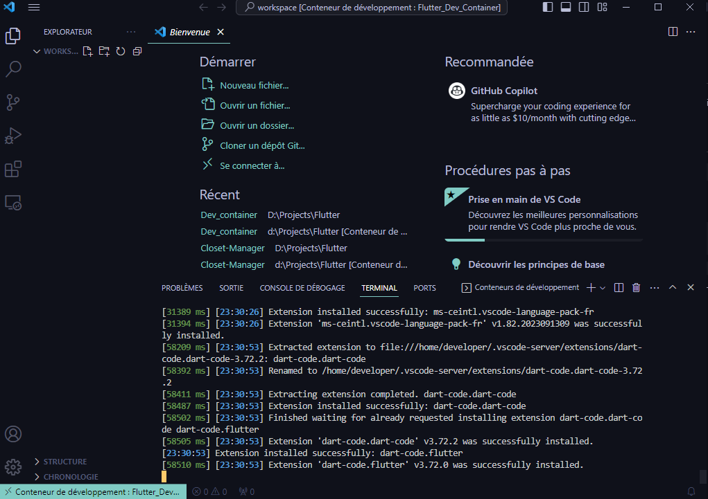

# Flutter_Dev_Container
A container to setup the dev environment for flutter application

# Prerequisites

> You need tou install : 
  - Docker for windows, linux or mac
  - vscode plus extensions
    - Remote development
    - Docker

> After that,
  - Clone the repository
  - Open directory in vscode
  - Make **CTRL +  SHIFT + P** and select *Rebuild and reopen in container*

> Now you can clone your flutter project inside your new dev environment, enjoy 😁

**NB** 
 - The environment is configured to handling all your code inside the workspace directory. If you want to change this feature use the **devcontainer.json workspaceMount** property.

 - If you are on linux platform, this environment could not allow you access to your connected android devise. For this, you need to add the following line nin **devcontainer.json** file

 ***"mounts": ["source=/dev/bus/usb,target=/dev/bus/usb,type=bind"],***

# License
  

