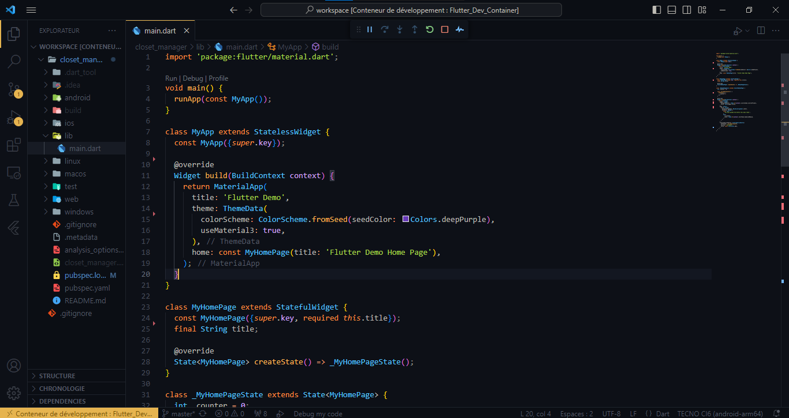

# Flutter_Dev_Container
A container to setup the dev environment for flutter application

# Prerequisites

> You need tou install : 
  - Docker engine for windows, linux or mac
  - vscode plus extensions
    - Remote development
    - Docker

> After that,
  - Clone the repository
  - Open directory in vscode
  - Make **CTRL +  SHIFT + P** and select *Rebuild and reopen in container*

> Now you can clone your flutter project inside your new dev environment, enjoy 😁

# Installation

  - After cloning the git project, from the command-line, you can create your flutter project inside the workspace directory by running ***flutter create project_name*** > ***cd project_directory*** > ***flutter run***

  - Run the following command to setup your android device ont the container ***(only for windows and mac os user)***
    >- adb kill-server
    >- adb tcpip 5555
    >- adb connect phone_ip_address:5555
    >- adb devices

**NB** 
  - You can delete the gitignore inside the workspace directory, it is just to avoid to push project data on container repository after editing container.
# License
  

